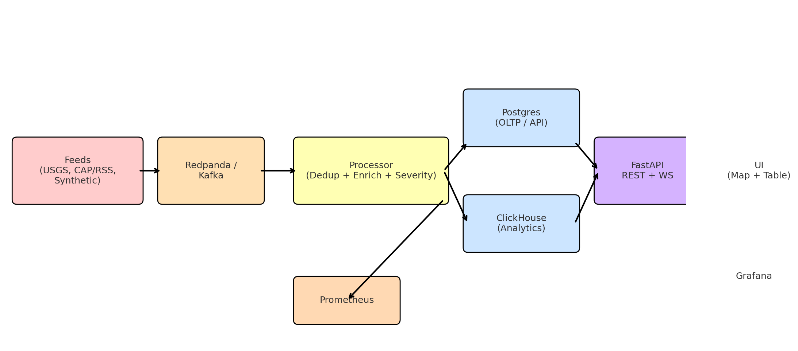

# CrisisPulse

[](https://github.com/anav94/crisispulse/actions/workflows/ci.yml)

> Real-time event intelligence pipeline: from noisy feeds → clean, geo-tagged incidents in seconds.

🔗 **Live Demo:** [coming soon – deploy link here]  
📊 **Dashboards:** Grafana (latency, duplicates, trends)  
🛠️ **Stack:** Python, Kafka/Redpanda, FastAPI, Postgres, ClickHouse, Docker, Grafana

---

## 🚀 Features

- Ingests multiple live feeds (USGS earthquakes, synthetic events, CAP/RSS)
- Deduplication via MinHash/LSH sliding window
- NLP enrichment: entity extraction + geocoding (h3 indices)
- Dual storage:  
  - Postgres for OLTP / API  
  - ClickHouse for analytics (sub-second queries)
- Real-time delivery: REST + WebSockets → live map/table UI
- Observability: Prometheus metrics, Grafana dashboards, CI badge
- Alert hooks (webhook/email) for “sev ≥ X within Y km”
- Data quality & drift checks (Evidently / Great Expectations)
- Orchestrator touch: Prefect flow for collectors
- Healthcheck endpoint + OpenAPI docs

---

## 📈 Quantitative Highlights

- **p95 latency:** ~3s ingestion → UI  
- **dedup efficiency:** ~70% duplicate drops on synthetic burst load  
- **throughput tested:** ~1,000 msgs/min sustained on local M2 Mac  
- **alert SLA:** near-real-time (<5s) for sev ≥0.8

---

## 🖼️ Architecture



**Flow:**  
Collectors → Kafka/Redpanda → Processor (dedup + enrich) → Postgres + ClickHouse → FastAPI → UI (map/table) + Grafana

---

## 📊 Grafana Snapshots

- **Incidents per Minute** (ClickHouse time-series)  
- **Average Severity Over Time**  
- **Top Sources** (bar chart)  
- **Geo Map** (incident clusters)

---

## 🧩 Setup

```bash
git clone https://github.com/anav94/crisispulse.git
cd crisispulse
cp .env.example .env
docker compose up -d --build
docker compose exec api bash -lc "python -m app.db_init"


# CrisisPulse

[](https://github.com/anav94/crisispulse/actions/workflows/ci.yml)

Run locally on Docker (M2-friendly). Map + table, live updates, metrics.


Quick start:
1) `cp .env.example .env`
2) `docker compose up -d --build`
3) `docker compose exec api bash -lc "python -m app.db_init"`
4) UI http://localhost:8000 • Prometheus http://localhost:9090 • Grafana http://localhost:3000 (admin/admin)
