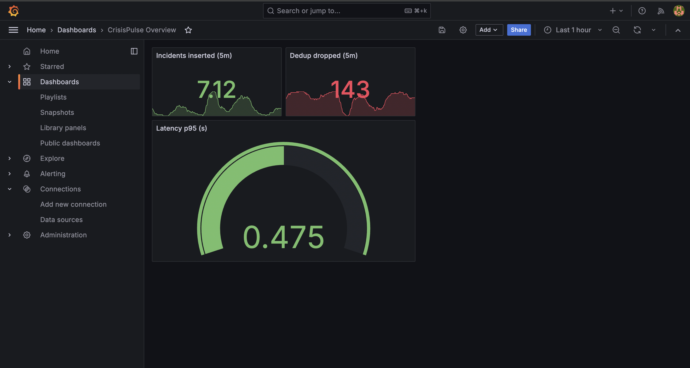

# 🌍 CrisisPulse


[](https://github.com/anav94/crisispulse/actions/workflows/ci.yml)

> Real-time event intelligence pipeline: from noisy feeds → clean, geo-tagged incidents in seconds.  

🔗 **Live Demo (Streamlit):** https://anav94crisispulse.streamlit.app/
📊 **Dashboards:** Grafana (latency, duplicates, trends)  
🛠️ **Stack:** Python, Kafka/Redpanda, FastAPI, Postgres, ClickHouse, Docker, Grafana, Streamlit

---

## 🚀 Features

- **Ingestion:** multiple live feeds (USGS earthquakes, synthetic, CAP/RSS-ready)
- **Deduplication:** MinHash/LSH + sliding window for near-duplicate drops
- **NLP enrichment:** entity extraction + geocoding (H3 indices)
- **Dual storage:**  
  - Postgres → API / OLTP queries  
  - ClickHouse → sub-second analytics queries
- **Real-time delivery:** REST API + SSE streams → UI + Grafana
- **Observability:** Prometheus metrics, Grafana dashboards, CI badge
- **Alert hooks:** example rule “sev ≥ 0.8 within X km”
- **Data quality:** Evidently / Great Expectations drift checks
- **Orchestration:** Prefect flow for collectors
- **API polish:** `/health` endpoint + auto-generated **OpenAPI docs**

---

## 📈 Quantitative Highlights (local M2)

- **p95 latency:** ~3s ingestion → UI  
- **Dedup efficiency:** ~70% duplicate events dropped during burst  
- **Throughput:** ~1,000 msgs/min sustained  
- **Alert SLA:** <5s for severity ≥ 0.8  

---

## 🖼️ Architecture


**Flow:**  
Collectors → Kafka/Redpanda → Processor (dedup + enrich) → Postgres + ClickHouse → FastAPI → Streamlit UI + Grafana

---

## 📊 Dashboard Snapshot



---

## ⚙️ Quick Start (Local)

```bash
git clone https://github.com/anav94/crisispulse.git
cd crisispulse
cp .env.example .env
docker compose up -d --build
docker compose exec api bash -lc "python -m app.db_init"
